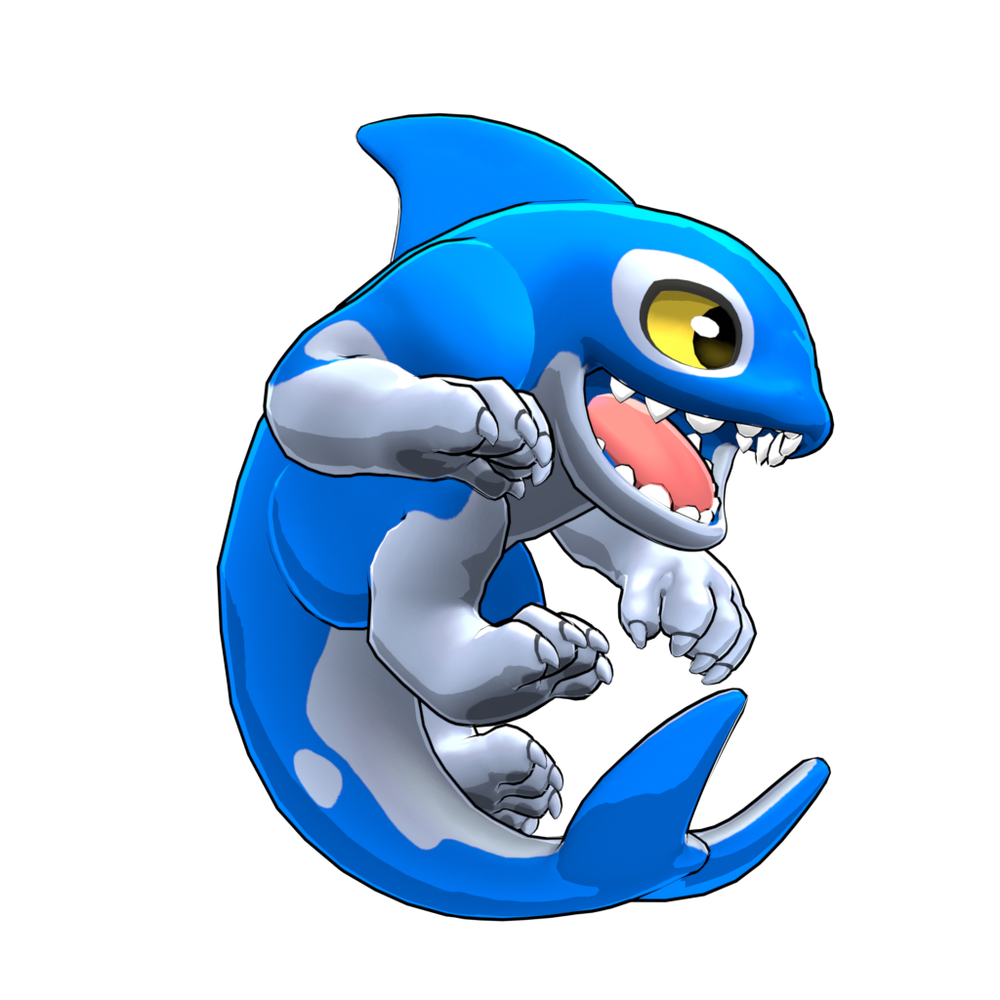
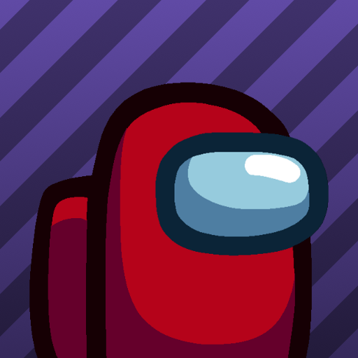

# Rivals2_Mod
 Repo of all mods i made during class

## Instaltion
### Windows
- Download one of the .pak file
- go to steam
- right click on the game
- "Manage"
- click on "Browse local file"
- on the folder, open the folder "rivals2"
- open "Content"
- open "Paks"
- create a folder named "mods"
- place the .pak file on the "mods" folder
- launche the game and bam it's modded

## Mods list
<!-- |name|desc||- [name](link)| -->

### Colot Palette

#### Forstburn
|Name|Desciption|Galerie|Link|
|--|--|--|--|
|ColdBlue Forstburn|Forstburn skin made base on @ yuma custom skin in rivals 1||- [Over default Blue](https://github.com/Me-Theo/Rivals2_Mod/releases/download/blue_white_frostburn/blue_white_frostburn_default_blue_P.pak)|

#### Orcan
|Name|Desciption|Galerie|Link|
|--|--|--|--|
|Trans Orcan|Orcan skin based on trans flag||- [Over default Mint](https://github.com/Me-Theo/Rivals2_Mod/releases/download/Trans_Orcan/transOrcan_default-mint_P.pak)|
|Dark green Orcan|First attempt to make a custom pallet||- [Over default Black](https://github.com/Me-Theo/Rivals2_Mod/releases/download/My_GreenBlack_Orcan/myPalGreenBlack_default-black_P.pak)
|Minecraft axoloto Orcan|Minecraft pink skin axolot for orcan||- [Over axolot default](https://github.com/Me-Theo/Rivals2_Mod/releases/download/minecraftPinkAxolot/mincraftAxolotoOrcan_axolot_normal_P.pak)|
|My orcan pallette - Default|my test to make my pallet - Default skin||- [Over default default](https://github.com/Me-Theo/Rivals2_Mod/releases/download/MyOrcanColor_Red/MyOrcanColor_Normal-default-normal_P.pak)  - [All palette](https://github.com/Me-Theo/Rivals2_Mod/releases/download/MyOrcanColor_Red/MyOrcanColor_P.pak)|
|My orcan pallette - Green|my test to make my pallet - Green skin||- [Over default default](https://github.com/Me-Theo/Rivals2_Mod/releases/download/MyOrcanColor_Red/MyOrcanColor_Green-default-green_P.pak)  - [All palette](https://github.com/Me-Theo/Rivals2_Mod/releases/download/MyOrcanColor_Red/MyOrcanColor_P.pak)|
|My orcan pallette - Red|my test to make my pallet - Red skin||- [Over default default](https://github.com/Me-Theo/Rivals2_Mod/releases/download/MyOrcanColor_Red/MyOrcanColor_Red-default-red_P.pak)  - [All palette](https://github.com/Me-Theo/Rivals2_Mod/releases/download/MyOrcanColor_Red/MyOrcanColor_P.pak)|
|My orcan pallette - Blue|my test to make my pallet - Blue skin||- [Over default default](https://github.com/Me-Theo/Rivals2_Mod/releases/download/MyOrcanColor_Red/MyOrcanColor_Blue-default-blue_P.pak)  - [All palette](https://github.com/Me-Theo/Rivals2_Mod/releases/download/MyOrcanColor_Red/MyOrcanColor_P.pak)|

#### Ranno
|Name|Desciption|Galerie|Link|
|--|--|--|--|
|Non binary Ranno |Ranno skin based non binary flag||- [Over default Blue](https://github.com/Me-Theo/Rivals2_Mod/releases/download/Non_Binary_Ranno/NonBinaryRanno_default_blue_P.pak)|

### Other

#### Icon
|Name|Desciption|Galerie|Link|
|--|--|--|--|
|Amoug us icon|amoug us icon over default icon||- [Over default icon](https://github.com/Me-Theo/Rivals2_Mod/releases/download/publish_mod/amougUsOverDefautlIcon_P.pak)|

#### GUI
|Name|Desciption|Galerie|Link|
|--|--|--|--|
|GAAAAA over GAME|Replace Game at the end of the game with "GAAAAA"||- [Over GAME at the end of the game](https://github.com/Me-Theo/Rivals2_Mod/releases/download/Gaaa_over_GAME/Gaaa_over_Game_P.pak)|
|GAY over GAME|Replace Game with GAY||- [Over GAME at the end of the game](https://github.com/Me-Theo/Rivals2_Mod/releases/download/GayOverGAME/Gay_Over_Game_P.pak)|

#### Emote
|Name|Desciption|Galerie|Link|
|--|--|--|--|
|Amoug us twerk hello message|Replace hello message emote with amoug us twerking||- [Over hello message gif](https://github.com/Me-Theo/Rivals2_Mod/releases/download/AmougUs_tweek_hello_message/AmougUs_Twerk_HelloMessage_P.pak)|
## Special thanks